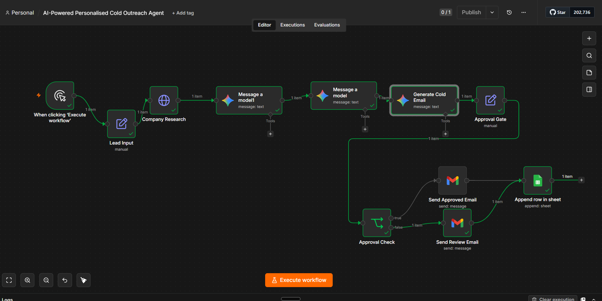
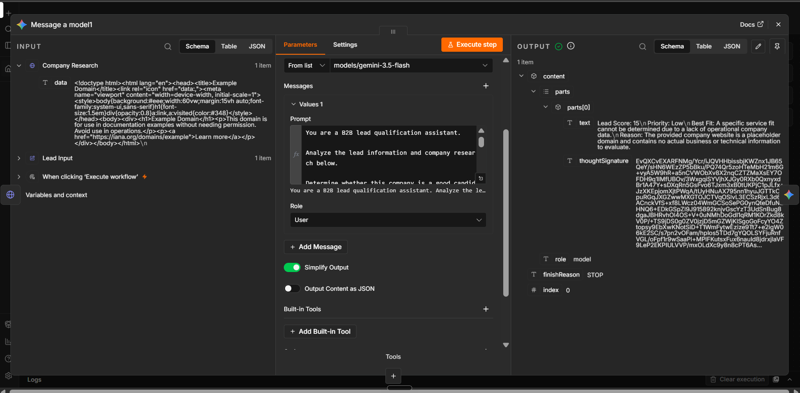
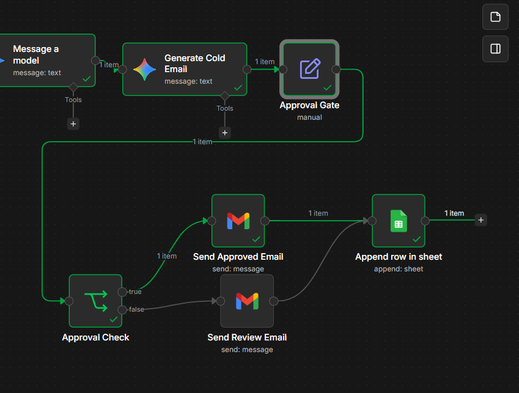

# AI-Powered Personalised Cold Outreach Agent

An AI-powered outreach automation built with n8n that researches leads, qualifies prospects, generates personalised cold emails, routes them through human approval, sends the appropriate email, and logs the outcome in Google Sheets.

## Overview

Cold outreach often requires repetitive manual work across lead research, qualification, personalization, email writing, sending, and tracking.

This workflow automates that process while keeping a human approval step before outreach is sent.

## Workflow

Lead Input
↓
Company Research
↓
AI Lead Qualification
↓
AI Cold Email Generation
↓
Human Approval Gate
↓
Approval Check
├── Approved → Send Approved Email
└── Review → Send Review Email
↓
Google Sheets Logging

## What It Does

- 🔎 Researches a company's website and analyzes the available information
- 🤖 Uses AI to qualify leads and assign a lead score and priority
- ✍️ Generates personalized cold outreach emails
- 👤 Includes a human approval gate before outreach
- 📧 Sends different emails based on approval status
- 📊 Logs lead, research, email, approval, and status information to Google Sheets
- 🔄 Handles both approved and rejected/review paths

## Tech Stack

- n8n — workflow orchestration and automation
- Google Gemini — AI-powered lead qualification and email generation
- Gmail — outbound email delivery
- Google Sheets — lead and outreach tracking
- HTTP/Web Requests — company website research
- GitHub — workflow versioning and documentation

## Workflow Architecture

Lead Input
    ↓
Company Research
    ↓
AI Lead Qualification
    ↓
AI Cold Email Generation
    ↓
Human Approval Gate
    ↓
Approval Check
   ↙           ↘
Approved      Review
   ↓            ↓
Send Approved  Send Review
Email          Email
   ↘            ↙
      Google Sheets
          Logging
## Key Features

- Automated company research
- AI-powered lead qualification
- AI-generated personalised cold emails
- Human-in-the-loop approval
- Automated Gmail delivery
- Approval and review paths
- Google Sheets activity logging
- Timestamped outreach records

## Human-in-the-Loop Approval

The system does not automatically send AI-generated outreach.

After the email is generated, it passes through an approval gate.

If approved, the workflow sends the approved email.

If not approved, the workflow sends a review email instead.

Both outcomes are recorded in Google Sheets.

## Data Logged

The workflow records:

- Company
- Website
- Contact name
- Job title
- Contact email
- Research summary
- Email subject
- Email body
- Approval status
- Email status
- Timestamp

## Tech Stack

- n8n
- Google Gemini
- Gmail
- Google Sheets

## Architecture

The workflow separates research, reasoning, generation, human approval, communication, and logging into distinct automation stages.

This makes the system easier to understand, control, and extend.

## Portfolio Note

This project demonstrates practical AI automation for a sales/outreach workflow, with an emphasis on controlled AI execution and reliable business-process automation.

## Workflow File

The complete n8n workflow is included in this repository as a JSON export.

## Workflow Screenshots

### Workflow Overview

### AI Lead Qualification

### Approved Outreach & Sheet Logging

